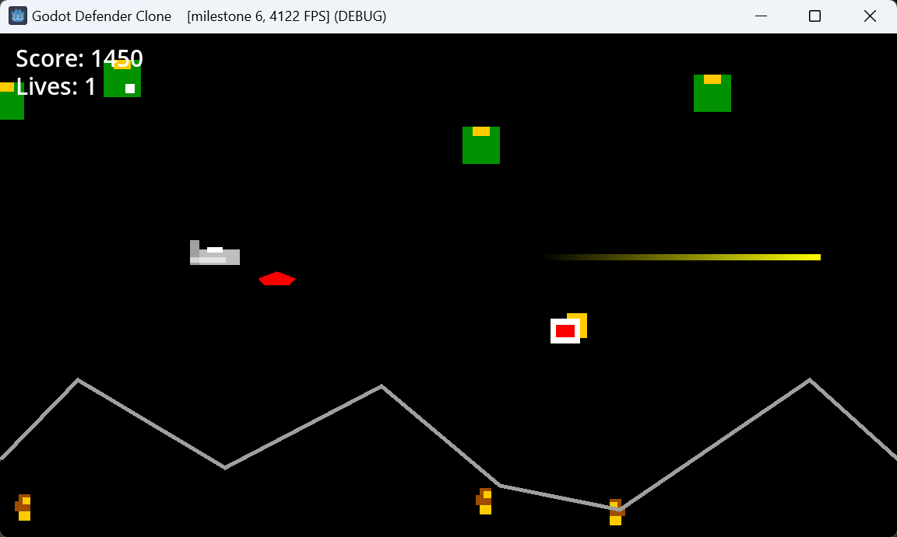

# Godot Defender Clone

A (kind of) clone of the 80's arcade game [Defender](https://www.mobygames.com/game/140/defender/screenshots/), a 2D side-scrolling shooter.

**This is WIP** and all the visuals are placeholders (based on the graphics in the C64 manual of Defender) that I'll eventually replace by proper pixel sprites. Also I won't make a perfect clone of Defender, I am just using the game as an example project to learn Godot. Also this is actually my first Godot project and so far I am having a pretty good time while learning the engine.

Playable web version: https://toxe.itch.io/godot-defender-clone

Playlist of short gameplay snippets of all the milestones:  
https://www.youtube.com/playlist?list=PLGbGLZ39xAFiEQbf70v8F0RuCvVGr5roT
